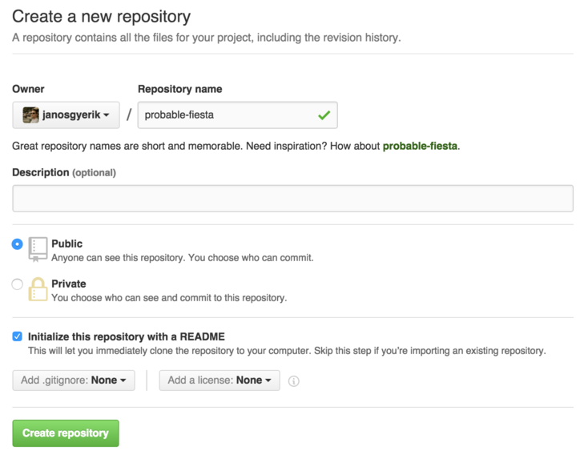
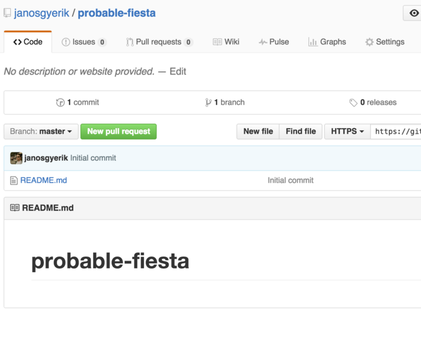
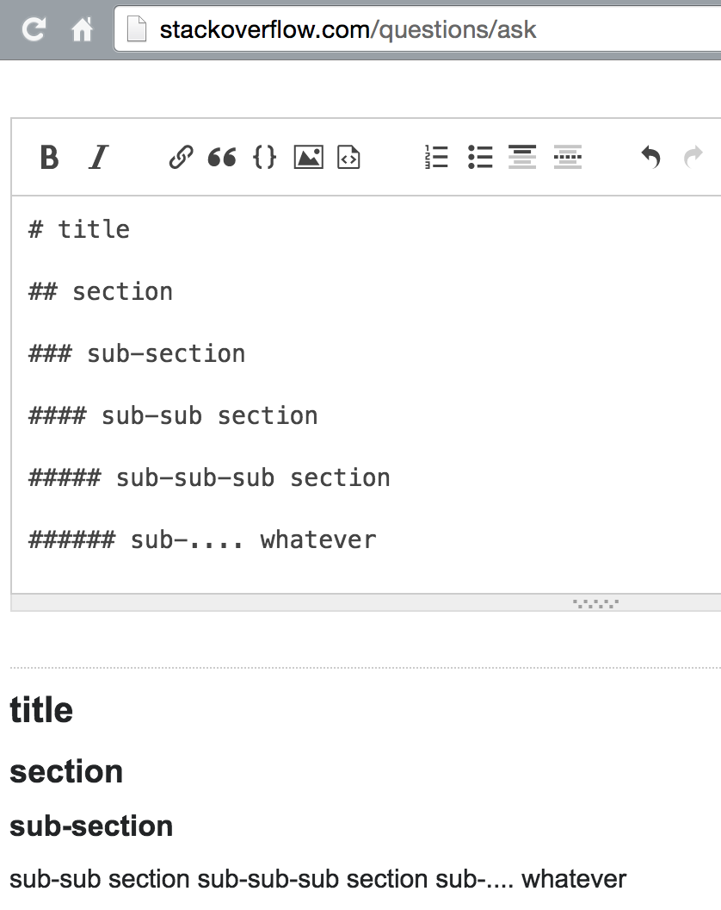

Writing Markdown well
=====================

*Note: work in progress...*

An opinionated guide to writing readable, semantically correct, portable Markdown.

Why Markdown?
-------------

Markdown is a lightweight markup language. You write it in plain text. It's (meant to be) simple, easy to read, easy to write. It's often used to format README files.

GitHub, for example, explicitly recommends adding a `README.md` file when you create a new project:



GitHub doesn't ask what format you prefer,
it just assumes you want to use Markdown:



It's also handy for other technical documentation in a project.

What's wrong with Markdown?
---------------------------

Ambiguity. Many features have many ways of writing them. Some ways are better than others, but the best way is often not obvious. Different users adopt different writing styles, which hurts readability.

What goes wrong with Markdown?
------------------------------

Markdown is not designed as a lazy way to create HTML, but many people use it that way.

In particular, these are some common mistakes when writing Markdown:

- Looks good when rendered as HTML, but looks crap as plain text

- Semantic violations of headings and inline formatting styles

- Using complicated nested structures

- Using not well-supported features, lock-in to specific renderers

- Other general writing style issues

Why this guide?
---------------

This is a collection of tips and recommendations when using Markdown, based on my experience of writing and reading a lot in this format. This is highly opinionated stuff, and you might not agree with everything. My goal is to prevent the most common issues mentioned above.

If some feature is not mentioned in this guide, it's most probably because I don't recommend it.

I'd like to hear your opinion and possibly improve this guide.

Why care about the plain text form?
-----------------------------------

Markdown was designed to be [nicely readable as plain text][philosophy].

You may not normally read it in plain text form, but sometimes you might still need to.

Other readers might read your documents in plain text.
Of course! The format was designed for that!

When you update the document later, you typically have to work with the plain text form.

Which of these documents would you rather work with?

TODO: 2 examples side by side, in plain-text form, first crap second pretty

Headings
--------

Headings drive the structure of a document.
Therefore it's crucial that they are loud and clear.

### Top-level headings

These are multiple equivalent ways to write a top-level heading:

    Document    Document    Document    # Document  #Document
    =           ===         ========

All of these are normally rendered as H1 headings (`<h1>` in HTML).

Which writing style is the most readable?

I recommend this one:

    Document
    ========

It stands out loud and clear, easily visible.

### Section headings (right below top-level)

These are multiple equivalent ways to write a level-2 heading:

    Section     Section     Section     ## Section  ##Section
    -           ---         -------

All of these are normally rendered as H2 headings (`<h2>` in HTML).

Which writing style is the most readable?

You guessed it: I recommend this one:

    Section
    -------

It stands out loud and clear, easily visible.

### Level-3 headings

These are equivalent ways to write a level-3 heading:

    ### Sub-section     ###Sub-section     

All of these are normally rendered as H3 headings (`<h3>` in HTML).

Which writing style is the most readable?

I recommend this one:

    ### Sub-section

This is more readable than when the symbols and text are stuck together.
The same way that code is more readable when you put spaces around operator symbols.

### Below level-3 headings

The original "spec" allows level 4-6 headers like this:

    #### sub-sub-section, rendered as <h4>
    ##### sub-sub-sub-oh-who-cares, rendered as <h5>
    ###### whatever, rendered as <h6>

Don't do this. Level 4-6 headers are often not well-supported.
Many renderers use normal paragraph style for such headers.



I suggest the following workarounds:

- Move the section with deeply nested sub-sections to a separate document

- Reorganize the document to eliminate deep nesting

- If the sub-sections are small enough, consider replacing them with bullet lists

The bottom line is: deeply nested documents are hard to read, and therefore not very useful. Simplify the document to eliminate deeply nested headings.

### Semantic correctness

A document should have only one title.
The obvious formatting style for that is H1.
Avoid multiple H1 headings within the same document.

A document often has multiple sections.
The obvious formatting style for section headers is H2.

A document should have headings ordered by their levels,
with no gaps in between. For example:

- H1 followed by H2 followed by H3 is correct
- H1 followed by H3, skipping H2 is incorrect
- H3 followed by H2 is incorrect

Order headings correctly and don't skip levels.

Inline styles
-------------

Use inline styles for:

- `*emphasis*`: enclose with single asterisks
- `**strong emphasis**`: enclose with double asterisks
- `` `inline code` ``: enclose with backticks

### Emphasis

When to use *emphasis*?

- Anything you want to emphasize
- Keywords, when defined for the first time within the text
- Key phrases, for example *single responsibility principle*

Don't use emphasis for code, commands (see inline code section below).

### Strong emphasis

When to use **strong emphasis**?

I use them to highlight GUI elements, such as:

- Window names
- Menu item names
- Button labels

Don't use strong emphasis for code, commands (see the section on inline code below).

### Inline code

When to use `inline code`?

- Class names
- Function names
- Variable names
- Very short inline example code
- Executable names
- Filenames

### Mixing inline styles on the same line

Is this easy to read?

    The quick *brown fox* **jumps** *over* the lazy **dog**

Not really.

- Avoid nesting inline styles
- Avoid using too many inline styles on the same line
- Avoid using inline styles willy-nilly

Code blocks
-----------

The spec allows indenting with 4 spaces or a single tab.
I suggest to use 4 spaces. For the usual reason: 4 spaces will look the same everywhere, while the display width of tabs may depend on the viewer.

Here's one way to format code blocks:

    View status with:

        git status -sb

Here's an equivalent way to format code blocks:

    View status with:
    ```
    git status -sb
    ```

What's wrong with fenced code blocks?

- Not supported so well as indented code blocks
- Doesn't look as clean and obvious in plain text

What's good about fenced code blocks?

They can allow language-specific syntax highlighting.
It's OK to use fenced code blocks when syntax highlighting is important and supported by the intended renderer.

Do add a blank line before and after fenced code blocks.

Lists
-----

TODO

### Unordered lists

TODO

- `*` and `-` are both intuitive
- `-` easiest to write as bullet

### Numbered lists

TODO

- Don't be lazy: number the bullets properly in numbered lists

### Common tips

- Don't put code blocks inside lists: it's complicated and poorly supported
- Add empty lines in between for more "packed" lists
- Lists of short keywords are easiest to read

Links
-----

TODO

- links
  - prefer `[title][name]` + reference over inline `[title](link)`

Other things to avoid
---------------------

Don't do this:

- Don't use deeply nested, tricky structures
    + move this to lists section
- Don't embed HTML. Try to use strictly plain text format
- Don't use line breaks (two spaces at end of line)
- Don't bother closing `###` headers
    + move this to headings section

Good habits
-----------

TODO

Not concluded
-------------

Here's a summary of features I don't have a strong opinion (and recommendation) about, yet:

- Horizontal rules
  - https://daringfireball.net/projects/markdown/syntax#hr
  - I use `---` because it's easy to type and easy enough to see

(scratch notes)
---------------

- readability
  - horizontal spacing
    + space before starting `*` and after closing `*`
  - vertical spacing
    + empty line between heading and body
    + empty line between paragraph and list
    + empty line around horizontal rule
  - number properly in numbered lists
  - break lines between list items if too long
  - align list items
  - use different symbol at different levels // matter of taste
  - use horizontal rules in consistent format
  - prefer `*` over `_`
  - don't use `_` for horizontal rule

- publisher rules
  - paragraph between heading and sub-heading or list
  - `*` for keywords, key terms, on first occurrence only


See also
--------

http://commonmark.org/

http://blog.codinghorror.com/standard-flavored-markdown/

http://www.adamhyde.net/whats-wrong-with-markdown/

[spec]: http://commonmark.org/
[standard-flavored-markdown]: http://blog.codinghorror.com/standard-flavored-markdown/
[syntax]: https://daringfireball.net/projects/markdown/syntax
[philosophy]: https://daringfireball.net/projects/markdown/syntax#philosophy
[comparable]: https://docs.oracle.com/javase/8/docs/api/java/lang/Comparable.html
